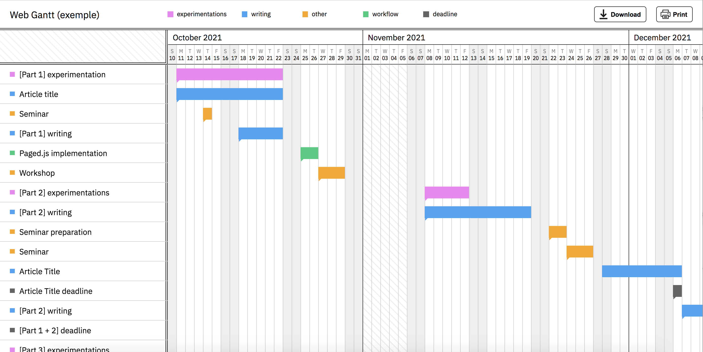

# Web Gantt

A simple interactive web page for your Gantt Chart (build with Vue.js)

No dependency required, no command line, just download the repo and launch the project using a local server.

How to use:
- Download or clone the repo
- Add/change the data of your project in the file `data.js`
- Launch the web page with a local server

Options:
- Download or print your Gantt Chart
- Change the langage (EN or FR)
- Choose the color for each type of items
- Define the size of the items
- Change the direction of the scroll (X, Y or both)

Warning:
- No phone style adaption for now

